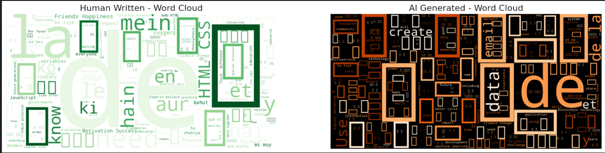

# 🔍 Unveiling the Machine: AI vs Human EDA 2026


## 📌 Overview
With the rapid advancement of Large Language Models (LLMs), distinguishing between human-written and AI-generated text has become a critical challenge in cybersecurity, education, and media. 

This project performs a comprehensive **Exploratory Data Analysis (EDA)** on the **AI vs Human Content Detection Dataset (2026 Edition)**. The goal is to uncover statistical and linguistic differences between human authors and AI models across various domains and languages.

## 📂 Dataset Information
The analysis is based on a robust benchmark dataset designed for 2026 standards.
- **Source:** [Kaggle - AI vs Human Content Detection Dataset 2026](https://www.kaggle.com/datasets/mafaqbhatti/ai-vs-human-content-detection-dataset-2026)
- **Classes:** Human, AI-Generated, Post-Edited AI.
- **Features:** Text content, Source Model (e.g., Llama-3, GPT-4), Domain (Education, News), and Edit Levels.

## 📊 Key Analysis & Visualizations
This notebook covers the following aspects:

1.  **Target Balance:** Analyzing the ratio of Human vs. AI content.
2.  **Metadata Analysis:** Distribution of languages, domains, and source models.
3.  **Text Length Patterns:** Comparing word counts between AI and Humans.
4.  **Lexical Analysis:** Word Cloud visualizations to detect stylistic differences.

### Sample Visualizations
*(Note: These are examples of the analysis outputs. See the notebook for full interactive plots.)*

| Target Distribution | Word Cloud (AI vs Human) |
| :---: | :---: |
|  |  |

> *Tip: Detecting AI content isn't just about keywords; it's about structure and verbosity.*

## 🚀 Getting Started

### Prerequisites
Ensure you have Python installed. You can install the required libraries using pip:

```bash
pip install -r requirements.txt
```

## Running the Notebook
### 1. Clone the repository:

```Bash
git clone https://github.com/goktani/AI-Human-Content-Detection-EDA.git
```
### 2. Navigate to the project directory:

```Bash
cd AI-Human-Content-Detection-EDA
```
### 3. Launch Jupyter Notebook:

```Bash
jupyter notebook
```
## 🛠 Technologies Used
*Python:* Core programming language.

*Pandas & NumPy:* Data manipulation and analysis.

*Matplotlib & Seaborn:* Static and statistical data visualization.

*WordCloud:* Text mining visualization.

## 🤝 Contributing
Contributions, issues, and feature requests are welcome! Feel free to check the issues page.

## 📜 License
This project is licensed under the MIT License.

*Author: Göktan İren*
